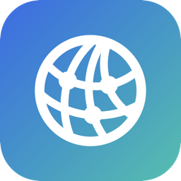

<p align="center">
  
</p>

# OllamaBridge

A macOS menu bar app that makes a remote [Ollama](https://ollama.com) server look like it's running locally.

Point any app at `http://localhost:11434` — the address Ollama uses by default — and OllamaBridge transparently forwards every request to an Ollama instance running on another machine on your network. No changes needed in the client app, no custom base URLs to configure.

## How it works

OllamaBridge is a raw TCP pass-through proxy, not an HTTP proxy. It doesn't parse or understand Ollama's API — it just relays bytes in both directions between `localhost:11434` and `<remote-host>:<remote-port>`. That means streaming generation, chunked responses, and any current or future Ollama endpoint all work automatically, with nothing to update as the API evolves.

## Requirements

- macOS 13 (Ventura) or later
- An Ollama server reachable on your local network, configured to accept non-local connections (see below)

## Install

### Option 1: Download the installer

1. Grab the latest `.pkg` from [Releases](https://github.com/RayMunro/OllamaBridge/releases)
2. Double-click it and follow the installer — it places `OllamaBridge.app` in `/Applications`

The app isn't signed with a paid Apple Developer ID, so Gatekeeper will flag it as from an unidentified developer the first time:

- Right-click (Control-click) the `.pkg` and choose **Open**, then confirm, or
- If it's blocked outright, go to **System Settings → Privacy & Security** and click **Open Anyway** next to the OllamaBridge notice

### Option 2: Build from source

Requires Xcode Command Line Tools (Swift 5.9+):

```bash
git clone https://github.com/RayMunro/OllamaBridge.git
cd OllamaBridge
./build_app.sh
open OllamaBridge.app
```

To produce a distributable `.pkg` installer instead:

```bash
./build_pkg.sh
```

## Setting up the remote Ollama server

By default, Ollama only listens on `127.0.0.1`, which refuses connections from other machines. On the machine running Ollama, set it to listen on all interfaces:

- **macOS app:** quit Ollama, run `launchctl setenv OLLAMA_HOST 0.0.0.0`, then relaunch it
- **CLI:** stop it and restart with `OLLAMA_HOST=0.0.0.0 ollama serve`
- **Docker:** set the `OLLAMA_HOST` container environment variable to `0.0.0.0:11434`

Confirm it worked from your Mac:

```bash
curl http://<remote-ip>:11434/api/tags
```

That should return JSON, not a connection error.

## Using OllamaBridge

1. **Quit any local Ollama** on your Mac first — OllamaBridge needs port 11434 for itself, and a locally running Ollama will already be holding it.
2. Launch OllamaBridge. It appears both in the Dock and as a menu bar icon.
3. Enter the remote server's **Host** and **Port**, then click **Start**.
4. Any local app or script that talks to `http://localhost:11434` now transparently reaches the remote server.

Closing the main window doesn't quit the app — it keeps running via the menu bar icon. Use **Open OllamaBridge…** from the menu bar to bring the window back, or **Quit OllamaBridge** to fully exit.

### Model management

- **Check Version** — shows the remote Ollama server's version
- **Model** picker — lists models installed on the remote server; refresh with the circular-arrow button
- **Delete** (trash icon) — removes the selected model from the remote server, after confirmation. This is irreversible; the model has to be re-downloaded to use it again.
- **Models directory** — since Ollama's API doesn't expose where models are stored on disk, this is a path you enter yourself (the models directory configured on the remote server). Once set, OllamaBridge computes and displays the expected manifest path for whichever model is selected.
- **Download a Model** — enter a model name (e.g. `llama3.2:3b`) and click **Pull** to download it directly onto the remote server, with a live progress bar. **Cancel** aborts the transfer.

### Other settings

- **Launch at login** — registers OllamaBridge to start automatically when you log in

## License

© 2026 Raymond Munro
